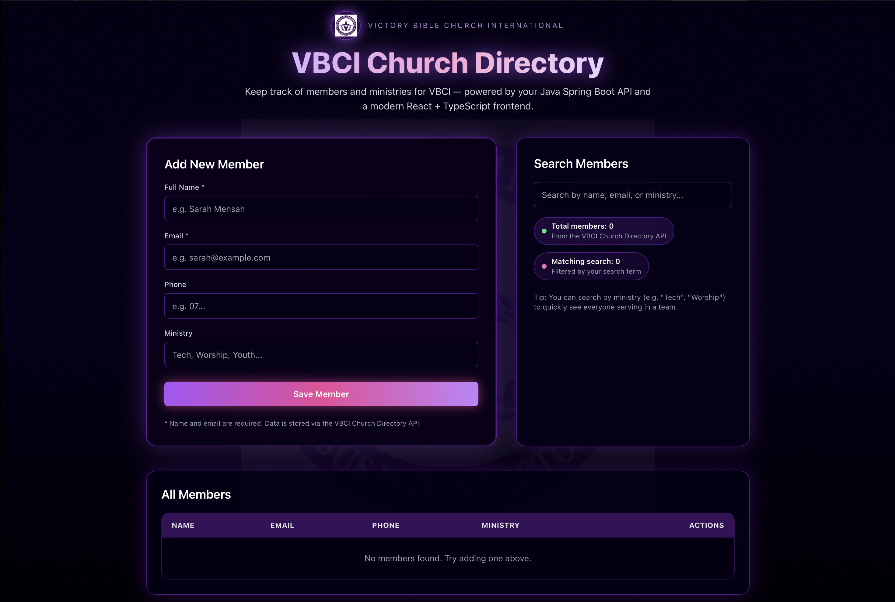
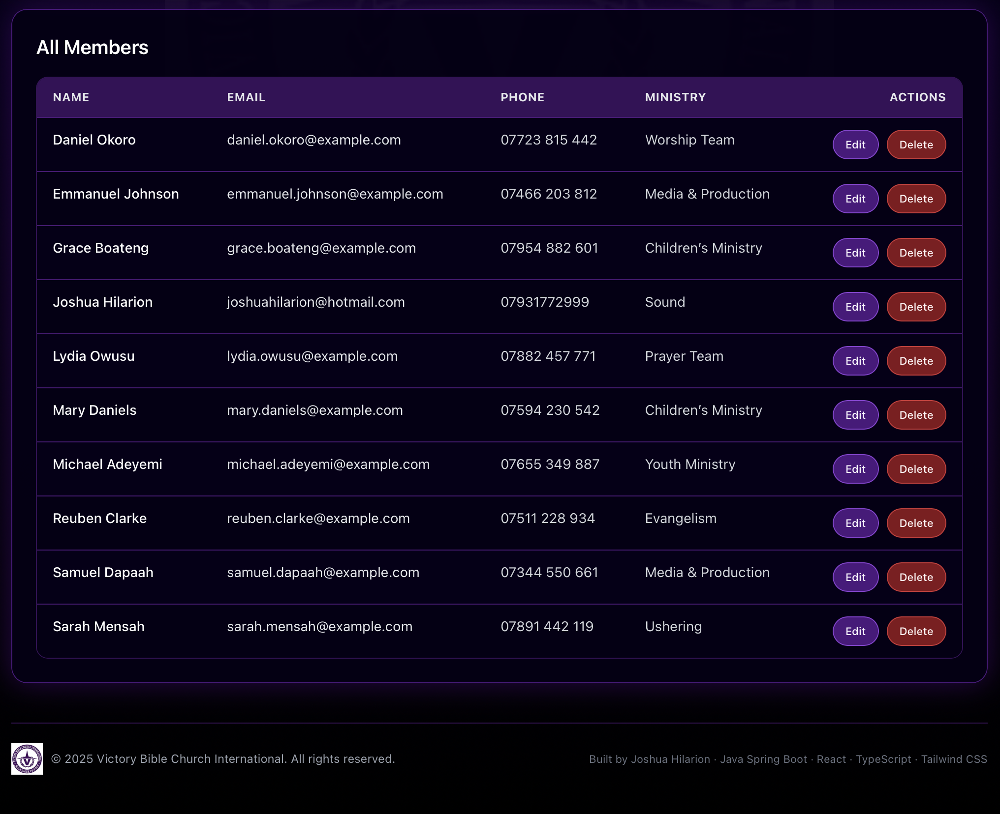
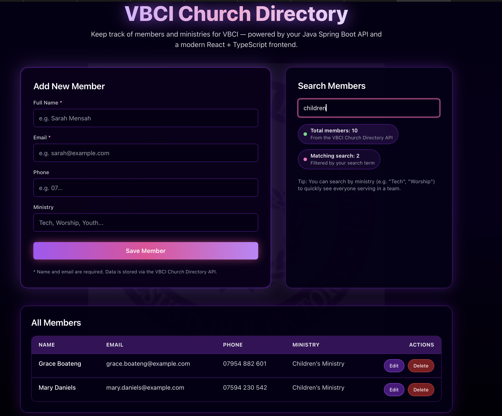
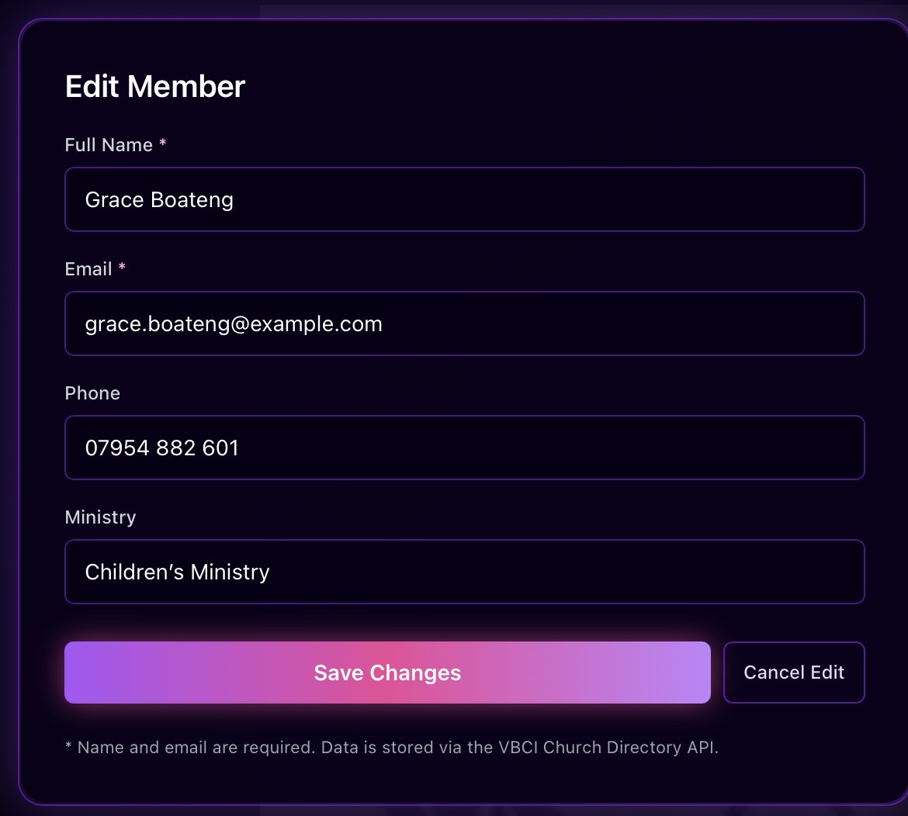

# 📖 VBCI Church Directory (React + TypeScript UI)

The VBCI Church Directory started as a simple internal tool (the old “Streamlit” version) and eventually grew into a complete **full-stack church directory system**.  
This repository contains the **modern React + TypeScript frontend**, built to connect to a Java Spring Boot API and display members, ministries, and other directory information in a clean, modern UI.

I rebuilt this project to take something the church already needed and **level it up into a structured, scalable, and easy-to-use web application**.

---

## 🧰 Tech Stack

**Frontend:**  


**Backend (separate repo):**  


Backend API:  
👉 https://github.com/JoshHil97/church-directory-api  

Original Python version:  
👉 https://github.com/JoshHil97/church_directory

---

## ✨ Features

- Add new members with name, email, phone, and ministry
- Full searchable directory (search by name, email, or ministry)
- Filtered results update live as you type
- Clean React + TypeScript UI
- Tailwind-powered modern styling
- Edit / Delete functionality for each member
- Connects to Spring Boot API for all CRUD operations
- Realistic church-use workflow

---

## 🖼 Screenshots










---

## 🔄 Evolution of This Project  
### **From Streetlight → To Full-Stack App**

**Version 1 — “Streamlit” (Original Python Version)**  
- Originally a simple internal tool made in Python/Streamlit  
- It handled basic member records  
- No real backend, no database schema, limited UI  
- Useful, but not scalable or easy to maintain

**Version 2 — Full-Stack Rebuild (React + Spring Boot)**  
- Frontend rewritten in React + TypeScript for speed and clarity  
- Backend upgraded to a full Spring Boot REST API  
- Database moved to PostgreSQL with proper relations  
- Improved UI/UX with Tailwind and responsive layout  
- Search, filtering, validation, and CRUD added  
- Fully deployable architecture (Vercel + Render/Railway)

This project is where my **full-stack problem-solving skills** really came to life — breaking complex things down until they made sense, then building them back cleanly.

---

## 🚀 Running the Project Locally

### 1️⃣ Clone the repository
```sh
git clone https://github.com/JoshHil97/vbci-church-directory-ui.git
cd vbci-church-directory-ui


# React + TypeScript + Vite

This template provides a minimal setup to get React working in Vite with HMR and some ESLint rules.

Currently, two official plugins are available:

- [@vitejs/plugin-react](https://github.com/vitejs/vite-plugin-react/blob/main/packages/plugin-react) uses [Babel](https://babeljs.io/) (or [oxc](https://oxc.rs) when used in [rolldown-vite](https://vite.dev/guide/rolldown)) for Fast Refresh
- [@vitejs/plugin-react-swc](https://github.com/vitejs/vite-plugin-react/blob/main/packages/plugin-react-swc) uses [SWC](https://swc.rs/) for Fast Refresh

## React Compiler

The React Compiler is not enabled on this template because of its impact on dev & build performances. To add it, see [this documentation](https://react.dev/learn/react-compiler/installation).

## Expanding the ESLint configuration

If you are developing a production application, we recommend updating the configuration to enable type-aware lint rules:

```js
export default defineConfig([
  globalIgnores(['dist']),
  {
    files: ['**/*.{ts,tsx}'],
    extends: [
      // Other configs...

      // Remove tseslint.configs.recommended and replace with this
      tseslint.configs.recommendedTypeChecked,
      // Alternatively, use this for stricter rules
      tseslint.configs.strictTypeChecked,
      // Optionally, add this for stylistic rules
      tseslint.configs.stylisticTypeChecked,

      // Other configs...
    ],
    languageOptions: {
      parserOptions: {
        project: ['./tsconfig.node.json', './tsconfig.app.json'],
        tsconfigRootDir: import.meta.dirname,
      },
      // other options...
    },
  },
])
```

You can also install [eslint-plugin-react-x](https://github.com/Rel1cx/eslint-react/tree/main/packages/plugins/eslint-plugin-react-x) and [eslint-plugin-react-dom](https://github.com/Rel1cx/eslint-react/tree/main/packages/plugins/eslint-plugin-react-dom) for React-specific lint rules:

```js
// eslint.config.js
import reactX from 'eslint-plugin-react-x'
import reactDom from 'eslint-plugin-react-dom'

export default defineConfig([
  globalIgnores(['dist']),
  {
    files: ['**/*.{ts,tsx}'],
    extends: [
      // Other configs...
      // Enable lint rules for React
      reactX.configs['recommended-typescript'],
      // Enable lint rules for React DOM
      reactDom.configs.recommended,
    ],
    languageOptions: {
      parserOptions: {
        project: ['./tsconfig.node.json', './tsconfig.app.json'],
        tsconfigRootDir: import.meta.dirname,
      },
      // other options...
    },
  },
])
```

---

## 2️⃣ Frontend README – `church-directory-ui/README.md`

Open `church-directory-ui/README.md` and replace with:

```md
# VBCI Church Directory – Frontend

A modern React frontend for the **Victory Bible Church International (VBCI) Church Directory**, powered by a Java Spring Boot API.

This app lets church admins:

- Add new members
- Search by name, email, phone, or ministry
- Edit existing member details
- Delete members
- View live stats (total members, search matches)

All wrapped in a custom VBCI-branded UI with the official logo and purple theme.

## Tech Stack

- React (with Vite)
- TypeScript
- Tailwind CSS
- Fetch API (calling the Spring Boot backend)

## Screens

### Main Screen

- **Header**  
  - VBCI logo  
  - Title: **VBCI Church Directory**  
  - Subtitle: “Jesus is our victory…”

- **Add / Edit Member Card**  
  - Full Name (required)  
  - Email (required)  
  - Phone  
  - Ministry (Tech, Worship, Youth, Sound…)  
  - Button changes between **“Save Member”** and **“Update Member”**  
  - “Cancel edit” link when editing

- **Search & Stats Card**  
  - Search bar (live filtering by name, email, phone, ministry)  
  - Total member count  
  - Matching search count  

- **Members Table**  
  - Columns: Name, Email, Phone, Ministry, Actions  
  - Actions: **Edit** + **Delete**

## API Integration

The frontend expects the backend to run at:

```text
http://localhost:8080/api/members
